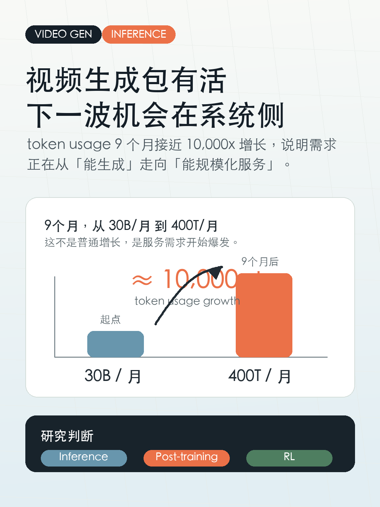
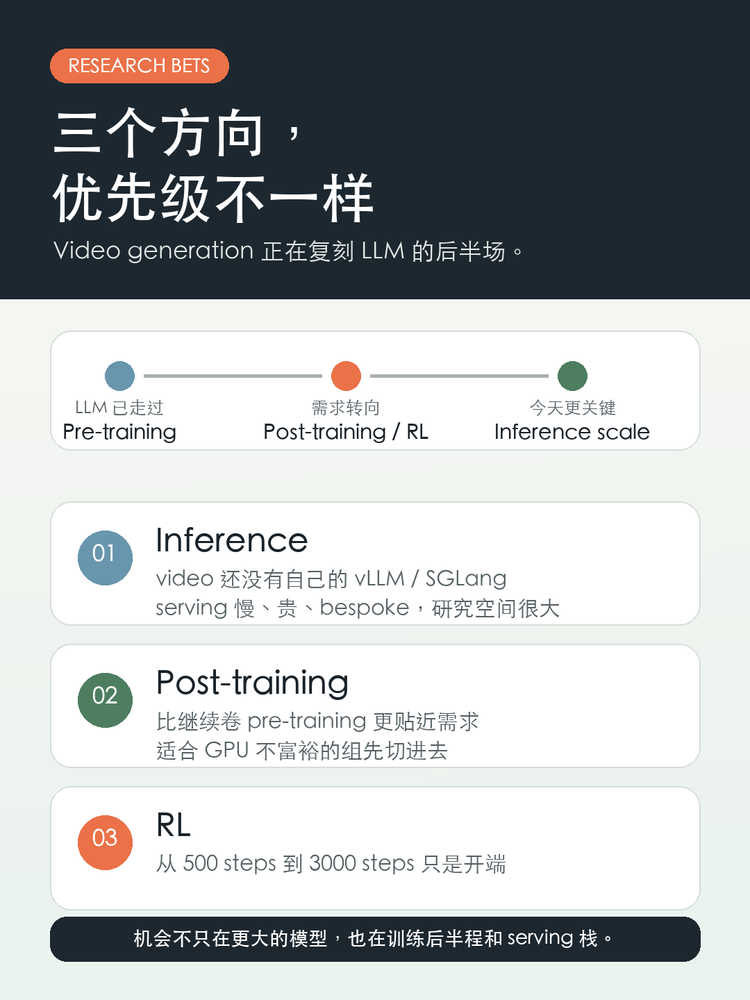

# 视频生成包有活

看到 Together AI 的数字，最容易漏掉的一点是：

✅ token usage 接近 10,000x 的增长，只用了 9 个月。  
从 30B tokens/月到 400T tokens/月。

前两天有人问我：video generation researcher 现在应该做什么？

我的答案很简单：**inference、post-training、RL**。

原因是：**LLM 是 video generation 的前置预演**。

LLM 的需求已经从 pre-training 转向 post-training/RL，再到今天越来越关键的 inference。Video generation 还落在后面，所以机会反而更清楚。

## 1️⃣ Inference：video 还没有自己的 vLLM/SGLang

LLM 这边已经有 SGLang、vLLM 这样的系统栈，但 video generation 还没有接近的东西。

现在的视频模型 serving 仍然很 bespoke、慢、贵。这里不是纯工程优化，而是很大的研究空间。

## 2️⃣ RL：video 里还远没跑通

Video generation 里的 RL 还很早。

现有 literature 里最长的 RL training 大概接近 500 steps；我们最近的 work 可以把这个推进到 3000 steps。

这是进展，但离 LLM 里的 RL 成熟度还很远。

## 3️⃣ 系统 infra 也明显落后

RL training system、inference serving infra，以及 RL 训练里用来生成 rollouts 的 serving stack，都比 LLM 落后一大截。

所以如果你不是 GPU 很富裕的组，我会觉得：

✅ inference  
✅ post-training

是非常合理的 research bets。

RL 也值得做，但更吃系统、数据和算力，短期门槛更高。

标签：视频生成、AIGC、AI系统、科研方向、研究生科研、LLM
